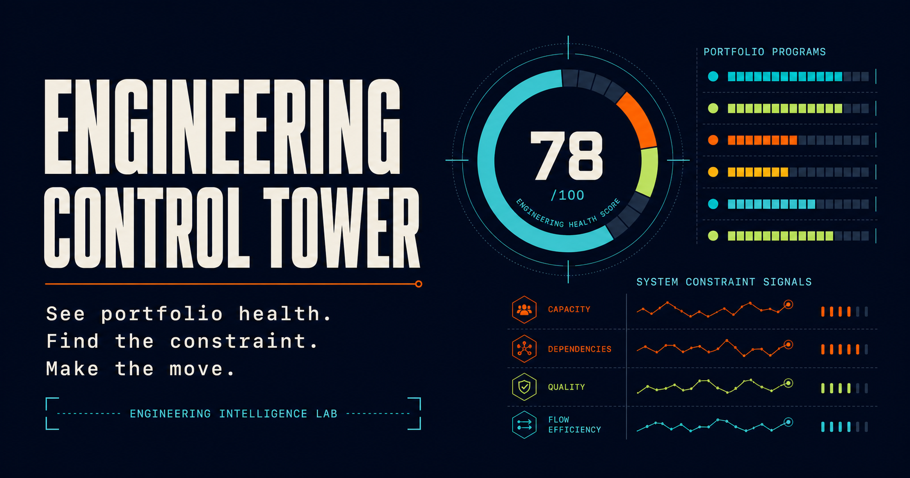

# Engineering Control Tower

An executive engineering portfolio intelligence reference implementation for senior and principal technology program, engineering delivery, and portfolio leaders.

The application turns fragmented program, flow, quality, reliability, security, and capacity signals into an explainable view of portfolio health, system constraints, intervention priorities, and accountable decisions.

> Public reference implementation based on enterprise operating patterns. Every organization, program, person, and data point is fictional and synthetic.

**Live application:** [engineering-control-tower.vercel.app](https://engineering-control-tower.vercel.app)



## What V1 demonstrates

- Executive engineering health overview
- Program-level scorecards and outcome confidence
- Explainable weighted health methodology with hard governance rules
- System constraint and capacity analysis
- Comparable team signals with contextual drill-down
- Six-week portfolio trend
- Decision and intervention queue
- No-API-key AI portfolio brief fallback

## Leadership questions it answers

1. Which outcomes are genuinely exposed?
2. What shared constraint is limiting the portfolio?
3. Where should leadership intervene first?
4. Why did a team or program receive its score?
5. Which decision, owner, and verification window will change the signal?

## Health model

Engineering health combines six visible dimensions:

| Dimension | Weight |
| --- | ---: |
| Outcome confidence | 25% |
| Delivery predictability | 20% |
| Quality | 15% |
| Reliability | 15% |
| Security readiness | 15% |
| Capacity sustainability | 10% |

Explicit governance rules cap or adjust the weighted score when critical evidence requires leadership attention. See [the methodology](docs/METHODOLOGY.md).

## Stack

- Next.js 16 App Router and React 19
- TypeScript and CSS
- Static synthetic data; no database or API key required
- Vercel-ready production configuration
- Cloudflare-compatible Sites build for a secondary public demo
- GitHub Actions for quality checks

## Local development

```bash
pnpm install
pnpm dev
```

Run all checks:

```bash
pnpm check
```

## Documentation

- [Product charter](docs/PRODUCT_CHARTER.md)
- [Information architecture and application architecture](docs/ARCHITECTURE.md)
- [Explainable methodology](docs/METHODOLOGY.md)
- [Synthetic data model](docs/DATA_MODEL.md)
- [Version roadmap](docs/ROADMAP.md)

## Portfolio context

Engineering Control Tower is project 03 in the **Engineering Intelligence Lab**, following:

1. [Release Intelligence](https://github.com/asuk1915-sudo/release-intelligence)
2. [Dependency Intelligence](https://github.com/asuk1915-sudo/dependency-intelligence)
3. Engineering Control Tower

## License

MIT. See [LICENSE](LICENSE).
