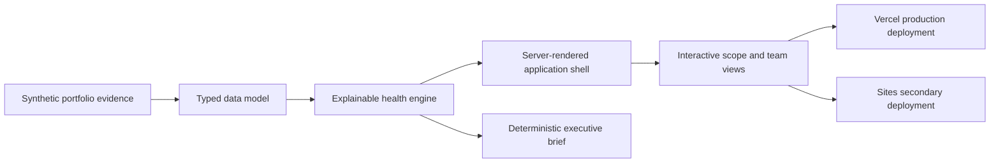
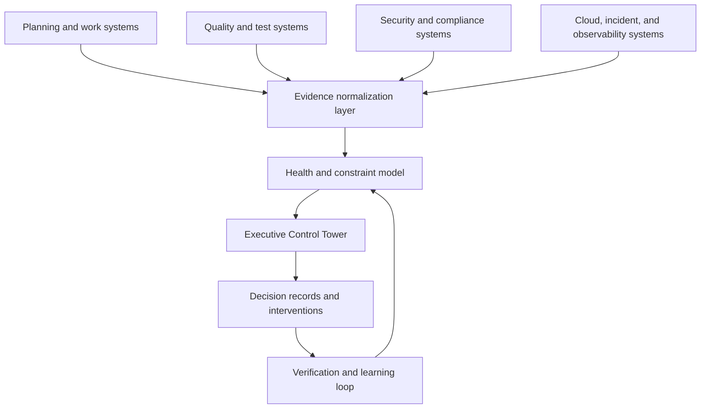

# Information and Application Architecture

## Information architecture

1. **Executive view** — portfolio score, leadership posture, and immediate exposure
2. **Portfolio health** — program outcomes and weighted health
3. **System constraints** — shared bottlenecks, excess demand, and propagation
4. **Team signals** — comparable evidence with contextual drill-down
5. **Portfolio trend** — health, evidence confidence, and flow trajectory
6. **Decision intelligence** — accountable decisions and AI portfolio brief

## Application architecture

## Enterprise evolution path

V1 intentionally uses static synthetic data. A future backend becomes useful only when evidence ingestion, history, access control, and decision persistence are introduced.
